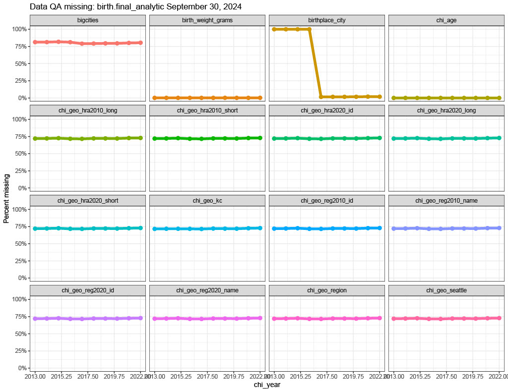
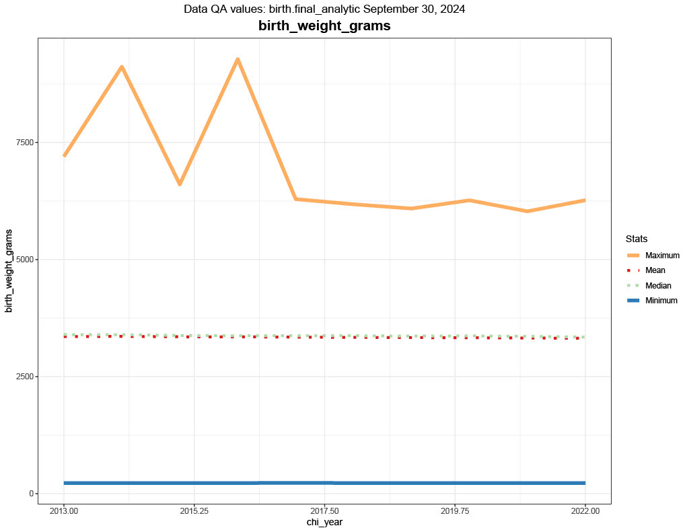
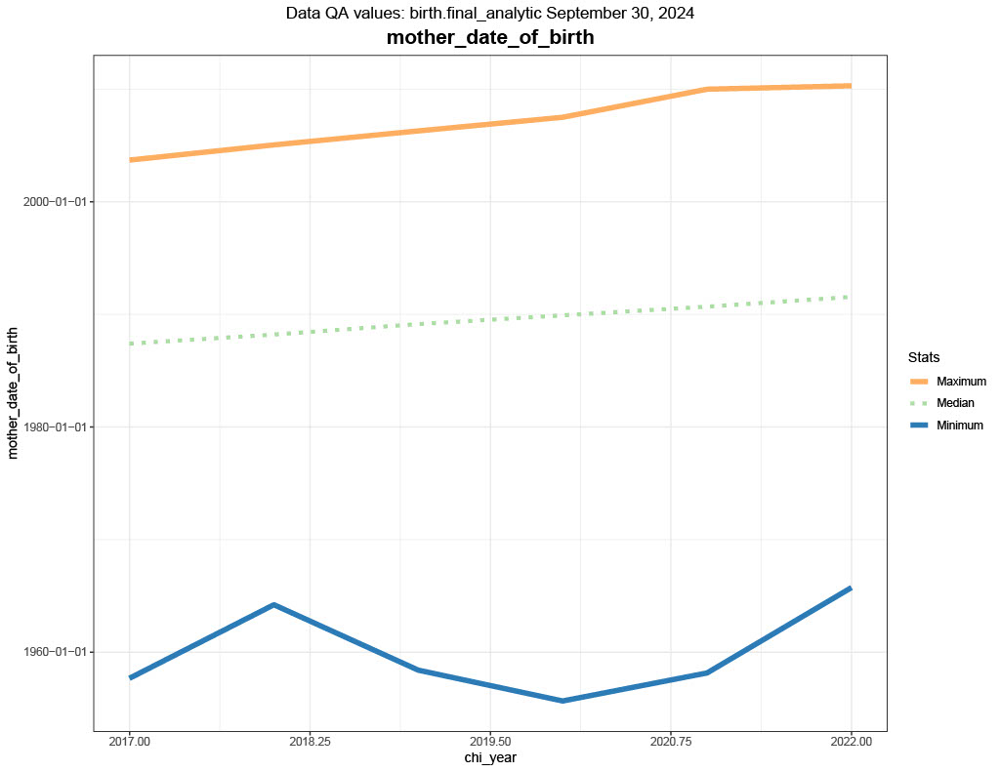
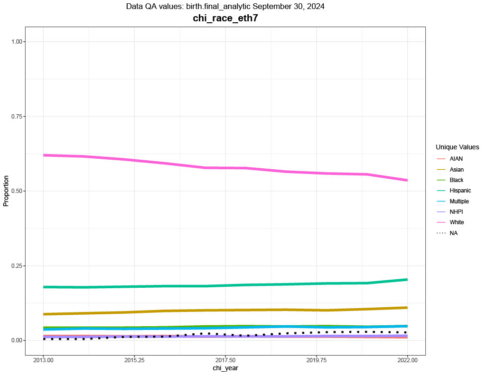

# etl_qa_run_pipeline()


# Introduction

The `etl_qa_run_pipeline()` function is designed to identify data
quality issues before performing data analysis. To maximize its
effectiveness, it is recommended to use this tool throughout the ETL
pipeline. It can be run after extraction to ensure that the data we
received is as expected and has not been corrupted during transmission.
After transformation, it can check for error introduced by coding
mistakes. Finally, after loading the data to its near-final destination,
it can be run again — perhaps by an analyst familiar with the data — to
check for any remaining data quality issues.

In essence, the function draws data from SQL Server, a data.table or
data.frame in R’s memory, or via the
[`rads::get_data_xxx`](https://github.com/PHSKC-APDE/rads/wiki/get_data)
functions. It identifies missing data and assesses changes in numeric
statistics and categorical frequency distributions over time. Results
are provided as tables that can be filtered and reviewed (and easily
read into Tableau) and as PDF graphs that help identify changes over
time. Optionally, it can check if variables align with CHI (Community
Health Indicators) standards.

# Sneak peek at QA output

The function returns a named list containing four items:

- `config`: Configuration settings used for the analysis
- `initial`: Initial ETL QA results
- `final`: Final ETL QA data.table summaries that are exported and used
  in plots
- `exported`: File paths for exported tables and plots

Here is a peek at the output generated by the example code that will be
discussed in detail below.

## Graphs

### Figure 1: Missingness

This graph shows the percentage of observations (i.e., rows) that are
missing at each time period.<br><br>


### Figure 2a: Numeric statistics

This graph shows basic statistics for *numeric* variables at each time
period.<br><br> 

### Figure 2b: Date statistics

This graph shows basic statistics for *date* variables at each time
period. Note that datetime variables such as `POSIXct` and `POSIXt` in R
and `datetime`, `datetime2`, and `smalldatetime` in SQL will assessed as
dates.<br><br> 

### Figure 2c: Categorical frequencies

This graph shows the proportion of observations with a given value at
each time period. It displays the top eight most frequent values PLUS
missing values (dotted line) PLUS all other values combined and labeled
‘Other values’. Note that numeric and date variables with six or fewer
distinct values will be treated as a categorical.<br><br>


## Tables

As you can see in the figure from Figure 2c, the proportion lines can
overlap and it can be difficult to identify all the differences that
might be of interest. For a more detailed exploration of this data, you
can view the tables stored in the exported Excel file (which are also
saved in the `final` item of the returned list). Here is a snapshot of
each of tables:

### missingness

Here is a sample of the ‘missingness’ worksheet saved to the Excel file.
You would be able to access this in R by typing something like
`myresult$final$missingness`. As per the default settings (which can be
adjusted), it is flagging \>= 3% *absolute* changes in the proportion
missing between adjacent time periods.

| time_period | varname         |  nrow | proportion | abs_change |
|------------:|:----------------|------:|-----------:|:-----------|
|        2013 | birthplace_city | 87829 |      1.000 | NA         |
|        2014 | birthplace_city | 89858 |      1.000 | NA         |
|        2015 | birthplace_city | 90371 |      1.000 | NA         |
|        2016 | birthplace_city | 91756 |      1.000 | NA         |
|        2017 | birthplace_city |  1347 |      0.015 | -98.5%     |
|        2018 | birthplace_city |  1398 |      0.016 | NA         |
|        2019 | birthplace_city |  1365 |      0.016 | NA         |
|        2020 | birthplace_city |  1423 |      0.017 | NA         |
|        2021 | birthplace_city |  1595 |      0.019 | NA         |

### values

Similarly, here is a sample from the ‘values’ worksheet
(`myresult$final$values`). The default settings flag rows with a \>= 2%
*relative* change in the mean value between adjacent years.

| time_period | varname | value | count | proportion | abs_proportion_change | vartype | mean | median | min | max | rel_mean_change | rel_median_change | median_date | min_date | max_date |
|---:|:---|:---|---:|---:|:---|:---|---:|---:|---:|---:|:---|:---|:---|:---|:---|
| 2020 | mother_date_of_birth | NA | NA | NA | NA | Date | NA | NA | NA | NA | NA | NA | 1989-12-03 | 1955-09-03 | 2007-07-07 |
| 2021 | mother_date_of_birth | NA | NA | NA | NA | Date | NA | NA | NA | NA | NA | NA | 1990-09-11 | 1958-02-28 | 2010-01-03 |
| 2022 | mother_date_of_birth | NA | NA | NA | NA | Date | NA | NA | NA | NA | NA | NA | 1991-07-24 | 1965-09-28 | 2010-04-23 |
| 2013 | num_prev_cesarean | NA | NA | NA | NA | Continuous | 0.180 | 0 | 0 | 9 | NA | NA | NA | NA | NA |
| 2014 | num_prev_cesarean | NA | NA | NA | NA | Continuous | 0.188 | 0 | 0 | 8 | 4.6% | NA | NA | NA | NA |
| 2015 | num_prev_cesarean | NA | NA | NA | NA | Continuous | 0.190 | 0 | 0 | 8 | NA | NA | NA | NA | NA |
| 2016 | num_prev_cesarean | NA | NA | NA | NA | Continuous | 0.190 | 0 | 0 | 7 | NA | NA | NA | NA | NA |
| 2017 | num_prev_cesarean | NA | NA | NA | NA | Continuous | 0.750 | 1 | 0 | 9 | 295% | Inf% | NA | NA | NA |
| 2018 | num_prev_cesarean | NA | NA | NA | NA | Continuous | 1.173 | 1 | 0 | 10 | 56.4% | NA | NA | NA | NA |

### chi_standards

Finally, if you set `check_chi = TRUE`, your Excel workbook will have a
sheet called ‘chi_standards’ (`myresult$final$chi_standards`). It
provides a simple ’\*’ to indicate when there is a misalignment between
the CHI standard and your data.

| chi_year | varname    | group    | your_data | chi | problem |
|---------:|:-----------|:---------|----------:|----:|:--------|
|     2019 | chi_race_7 | Black    |         1 |   1 | NA      |
|     2020 | chi_race_7 | Black    |         1 |   1 | NA      |
|     2021 | chi_race_7 | Black    |         1 |   1 | NA      |
|     2022 | chi_race_7 | Black    |         1 |   1 | NA      |
|       NA | chi_race_7 | Hispanic |         0 |   1 | \*      |
|     2013 | chi_race_7 | Multiple |         1 |   1 | NA      |
|     2014 | chi_race_7 | Multiple |         1 |   1 | NA      |
|     2015 | chi_race_7 | Multiple |         1 |   1 | NA      |
|     2016 | chi_race_7 | Multiple |         1 |   1 | NA      |

Now that you’ve learned what this function can can, let’s learn how to
use it!

# Setting up the environment

Start by loading the package:

``` r
library(apde)
```

# Function arguments

Since this function allows the user to QA data in three different data
sources that need different specifications, understanding the arguments
is not as simple as typing `args(etl_qa_run_pipeline)`. Here are all the
possible arguments as described in the helpfile
(`?etl_qa_run_pipeline`):

## `data_source_type`

Character string specifying the type of data source. Must be one of
`'r_dataframe'`, `'sql_server'`, or `'rads'`.

## `connection`

A DBIConnection object.<br>**Required only when
`data_source_type = 'sql_server'`**.

## `data_params`

List of data related parameters specific to the data source. Not all
parameters are needed for all data sources. Please review the examples
for details.

- ### `data_params$check_chi`

  Logical vector of length 1. When `check_chi = TRUE`, function will add
  any available CHI related variables to `data_params$cols` and will
  assess whether their values align with standards in
  `rads.data::misc_chi_byvars`.<br>Default is `check_chi = FALSE`.

- ### `data_params$cols`

  Character vector specifying the column names to analyze, e.g.,
  `cols = c('race4', 'birth_weight_grams', 'birthplace_city')`.

- ### `data_params$time_range`

  Character vector of length 2 specifying the start and end of the time
  range, e.g., `time_range = c(2015, 2024)`.

- ### `data_params$time_var`

  Character string specifying the time interval variable, e.g.,
  `time_var = 'chi_year'`.

- ### `data_params$data`

  Name of a data.frame or data.table that you want to assess with this
  function, e.g., `data = myDataTable`.<br>**Required only when
  `data_source_type = 'r_dataframe'`**.

- ### `data_params$function_name`

  Character string specifying the relevant rads::get_data_xxx function,
  e.g., `function_name = 'get_data_birth'`.<br>**Required only when
  `data_source_type = 'rads'`**.

- ### `data_params$kingco`

  Logical vector of length 1. Identifies whether you want limit the data
  to King County.<br>**Required only when
  `data_source_type = 'rads'`**.<br>Default is `kingco = TRUE`.

- ### `data_params$version`

  Character string specifying either `'final'` or
  `'stage'`.<br>**Required only when
  `data_source_type = 'rads'`**.<br>Default is `version = 'stage'`.

- ### `data_params$schema_table`

  The name of the schema and table to be accessed within the SQL Server
  connection. Must be in the form myschema.mytable, with a period as a
  separator, e.g.,
  `schema_table = 'birth.stage_analytic'`.<br>**Required only when
  `data_source_type = 'sql_server'`**.

## `output_directory`

Character string specifying the directory where output files will be
saved. If `NULL`, the current working directory is used.<br>Default is
`output_directory = NULL`.

## `digits_mean`

Integer specifying the number of decimal places for rounding the
reported mean, median, min, and max.<br>Default is `digits_mean = 3`.

## `digits_prop`

Integer specifying the number of decimal places for rounding
proportions.<br>Default is `digits_prop = 3`.

## `abs_threshold`

Numeric threshold for flagging *absolute* percentage changes in
*proportions.* Permissible range is \[0, 100\].<br>Default is
`abs_threshold = 3`.

## `rel_threshold`

Numeric threshold for flagging *relative* percentage changes in *means*
and *medians*. Permissible range is \[0, 100\].<br>Default is
`rel_threshold = 2`.

# Examples

As stated above, this function can QA data in SQL Server, a local
data.table/ data.frame, or from `rads`. Here we provide an example of
each method to QA the same data source. Since all three methods provide
identical output, we will only explore the SQL Server QA in detail
knowing that it is generalizable.

## QA SQL Server data

``` r
myconnection <- rads::validate_hhsaw_key()
qaSQL <- etl_qa_run_pipeline(
  data_source_type = 'sql_server',
  connection = myconnection,
  data_params = list(
    schema_table = 'birth.final_analytic',
    time_var = 'chi_year',
    time_range = c(2013, 2022),
    cols =c('chi_age', 'race4', 'birth_weight_grams', 'birthplace_city', 
            'num_prev_cesarean', 'mother_date_of_birth'), 
    check_chi = TRUE
  ), 
  output_directory = tempdir()
)
```

    Creating config object ... running etl_qa_setup_config()

    Analyzing data ... running etl_qa_initial_results()

    😦👿🤬⚠ 
    The following varname and group combinations exist in the rads.data::misc_chi_byvars 
    standards but are missing from your dataset. Please ensure your dataset complies with
    the CHI standard.

    |    varname|group        |note                                                      |
    |----------:|:------------|:---------------------------------------------------------|
    | chi_race_7|Hispanic     |It's OK! A race variable cannot also represent ethnicity. |
    |      race3|Hispanic     |It's OK! A race variable cannot also represent ethnicity. |
    |      race3|Non-Hispanic |It's OK! A race variable cannot also represent ethnicity. |

    Preparing results ... running etl_qa_final_results()

    Visualizing data ... running etl_qa_export_results()

    Finished! Check your output_directory: C:\Users\DCOLOM~1.KC\AppData\Local\Temp\Rtmp27aLWN

Since we set `check_chi = TRUE`, the function pulled in all available
CHI related variables and compared them to known standards. In this
case, it identified three deviations between the birth data and the CHI
standards. However, these are known issues that are related to
conception of the CHI variables rather than a data processing issue, so
there is a `note` letting the user know not to worry about the
discrepancy. I’ve hidden this message for the examples that follow to
simplify this vignette.

The final statement asks the user to check their `output_directory`,
which is `tempdir()`. Let’s see what is saved there:

``` r
list.files(tempdir())
```

     [1] "birth.final_analytic_qa_2024_09_30.xlsx"       
     [2] "birth.final_analytic_qa_missing_2024_09_30.pdf"
     [3] "birth.final_analytic_qa_values_2024_09_30.pdf"                           

- `birth.final_analytic_qa_missing_2024_09_30.pdf` contains graphs like
  the one showin in Figure 1.
- `birth.final_analytic_qa_values_2024_09_30.pdf` contains the graphs
  like those in Figures 2a, 2b, and 2c.
- `birth.final_analytic_qa_2024_09_30.xlsx` contains three worksheeets,
  one for each of the three tables given in the Tables section above.

We also saved the output as the object `qaSQL`. Let’s confirm that what
was written about the returned object in the Sneak peek section above
was correct:

``` r
# confirm it is a list
inherits(qaSQL, 'list')
```

    [1] TRUE

``` r
# get the name of the object in the returned list
names(qaSQL)
```

    [1] "config"   "initial"  "final"    "exported"

``` r
# get the names of the returned tables (which correspond to those in the Excel file)
names(qaSQL$final)
```

    [1] "missingness"   "values"        "chi_standards"

## QA data.table / data.frame data in memory

``` r
birth_data <- rads::get_data_birth(year = c(2013:2022), 
                             kingco = F, 
                             version = 'final')

qaDF <- etl_qa_run_pipeline(
  data_source_type = 'r_dataframe',
  data_params = list(
    data = birth_data,
    time_var = 'chi_year',
    time_range = c(2013, 2022),
    cols = c('chi_age', 'race4', 'birth_weight_grams', 'birthplace_city', 
             'num_prev_cesarean', 'mother_date_of_birth'), 
    check_chi = TRUE
  ), 
  output_directory = tempdir()
)
```

## QA `rads` data

``` r
qaRADS <- etl_qa_run_pipeline(
  data_source_type = 'rads',
  data_params = list(
    function_name = 'get_data_birth',
    time_var = 'chi_year',
    time_range = c(2013, 2022),
    cols = c('chi_age', 'race4', 'birth_weight_grams', 'birthplace_city',
             'num_prev_cesarean', 'mother_date_of_birth'),
    version = 'final',
    kingco = FALSE,
    check_chi = TRUE
  ),
  output_directory = tempdir()
)
```

## Confirm that the results from each method are identical

``` r
identical(qaDF$final, qaSQL$final)
```

    [1] TRUE

``` r
identical(qaDF$final, qaRADS$final)
```

    [1] TRUE

# Conclusion

Remember to consult the function documentation for more detailed
information on usage and parameters. Happy coding!

– *Updated by dcolombara, 2024-09-30*
